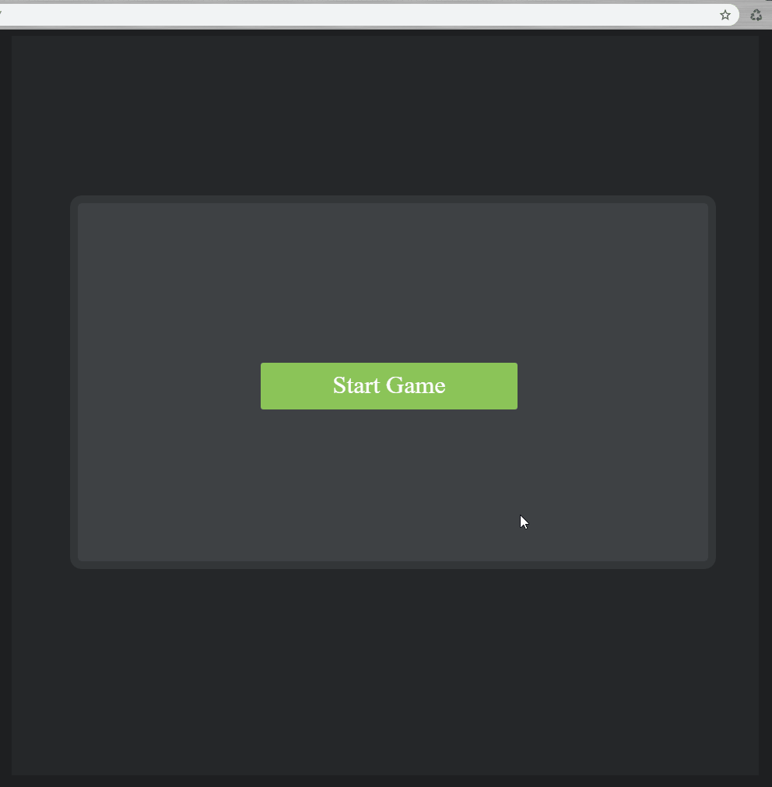
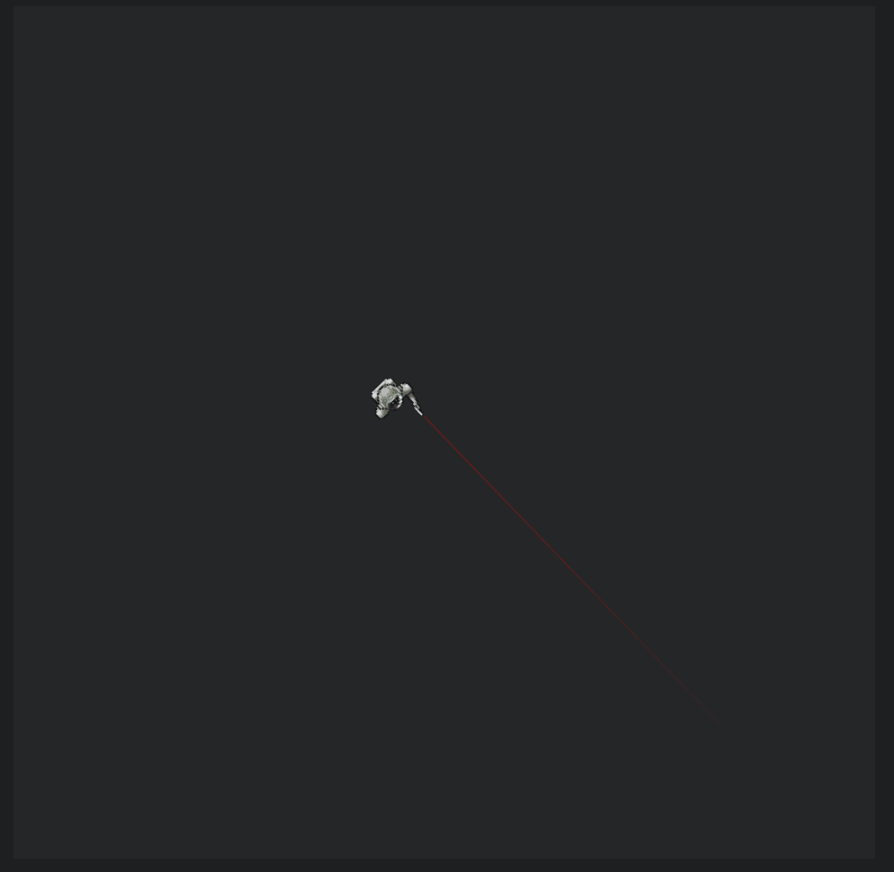

# Web-Game
Web game proof of concept

## Start

```
git clone https://github.com/achobanov/Web-Game
cd Web-Game
```

Build the client
```
cd Client
npm run build
```

Start the server
```
cd ../Server
npm start
```
## Client tools

Run in watch mode
```
npm run watch
```

Run the Typescript compiler without emitting .js
```
npm run types
```

## Gallery


